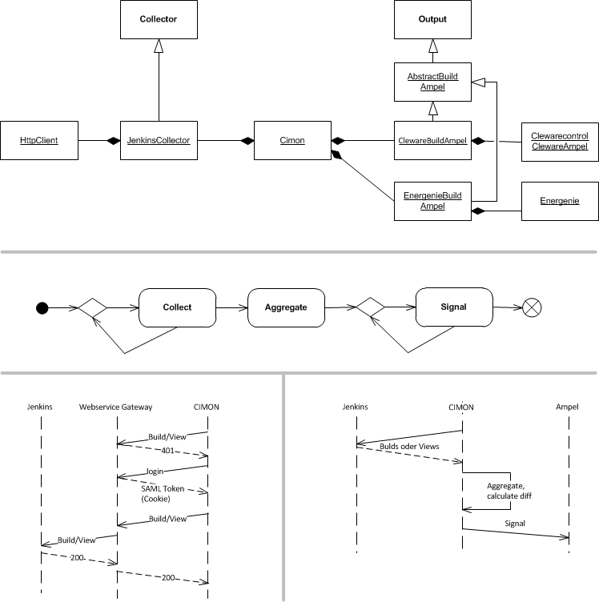

# Cimon controller
Copyright (C) Schweizerische Bundesbahnen SBB 2016, Apache Licence 2.0. Author: Florian Seidl (Github: florianseidl) 

Cimon implements a simple build momitor using a Raspberry Pi, a simple USB traffic light and an USB switchable socket. 

The cimon controller is a set of scripts written in python. It queries jenkins (and potentially other sources) and passes the result on to output devices (currently the energenie socket and the cleware USB traffic light).

The scripts are written in Python 3.4.

The setup of the device, start/stop scripts, autoupdate and so on are available within the https://github.com/SchweizerischeBundesbahnen/cimon_controller repository.

## Architecture

## Prerequisites
- Python 3.4
- The yaml module has to be installed http://pyyaml.org/wiki/PyYAML
- For Cleware Output: The clewarecontrol command line application build and in path and the cleware device accessible as user
- For Energenie Output: The sispmctl command line application build and in path and the energenie device accessible as user

## Usage
Provided your python3 command is 3.2 or higher

    python3 cimon.py
 
now the cimon main method ("masterboxcontrolprogram") should run in a loop until terminated by rescheduing a new check and output every interval seconds (configurable).

## Configuration
All Configuration is done via yaml the file "cimon.yaml". This file has to be located in the directory "cimon" in the user home (~/cimon/cimon.yaml). You can specify another location (including the file name) using the "-c" or "-config" parameter.

See controller/templates/cimon.yaml for the format and entries of the configuration file. You can use encrypted values for passwords if you provide a simple aes key file, see Key.

It is recommended to configure the jenkins configurator via views in oder to manage the build ids on the jenkins server.

### Key
In order to use encrypted passwords within the configuration you need to provide a 32 bit AES key (a binary file with 32 bit data) called key.bin in the cimon directory within the user home (~/cimon/key.bin). You can specify another location location (including the file name) using the "-k" or "--key" parameter. The decryption uses AES CTR via PyAES, see https://github.com/ricmoo/pyaes.

With the help of configutil.py you can encrypt passwords, decrypt passwords and generate an new keyfile (will not overwrite an existing file):

    python3 configutil.py [--key <keyfile>] --encrypt <plaintext>
    python3 configutil.py [--key <keyfile>] --decrypt <encrypted text>
    python3 configutil.py [--key <keyfile>] --generate
 
## Extend
The cimon is designed for you to add your own collector and output easily. Use the templates in templates directory or the existing collector and outputs as a starting point.

### Collector and Output
For both a collector and an output, you need to add a python module that is either in your user home directory cimon/plugins directory (~/cimon/plugins), the same directory as cimon.py or available in the python instance used. This module needs to implement the method

    def create(configuration, key=None):
        return CollectorOrOutputObject(foo = configuration["foo"], bar = configuration["bar"])

The configuration reflects the part of the cimon.yaml file within the collector or output list element of the given collector as shown above. The actual configuration keys in this section are specific to your collector or output. 
The key object is a binary string of an AES key for pyaes to decrypt passwords or other sensitive configuration stored within the configuration in encrypted and base64 encoded form.

### Adding collector
In order to add your own collector, you need to implement a class within your module as described above. This class has to implement the method "collect" and contain an attribute "type". It can optionally implement the method "close".

    class MyCollector:
        type = "strange" # the type of collector, defines the format of the status map used (e.g. "build")
    
        def close(self):
            pass # close your input, will be called at the start of the cimon application or if pausing. Will be called multiple times.

        def collect(self):
            return {} # query the status from server and put into a dictionary of status results. 
                      # This dictionary is read by the output accuring to the type of collector.

### Adding an output
In order to add your own output, you need to implement a class within your module as described above. This class has to implement the method "on_update" and can optionally implement the method "close".
  
    class MyOutput:
    
        def close(self):
            pass # close or reset your output device here if you need to, will be called on shutdown of the cimon application. Will be called multiple times.
            
        def on_update(self, status):
            pass # display the status on the given device

For Build output there is the base class "AbstractBuildOutput", and if your build output device is an ampel (traffic light) kind of device with red-yellow-green, you can extend "AbstractBuildAmpel" as defined within the output module.